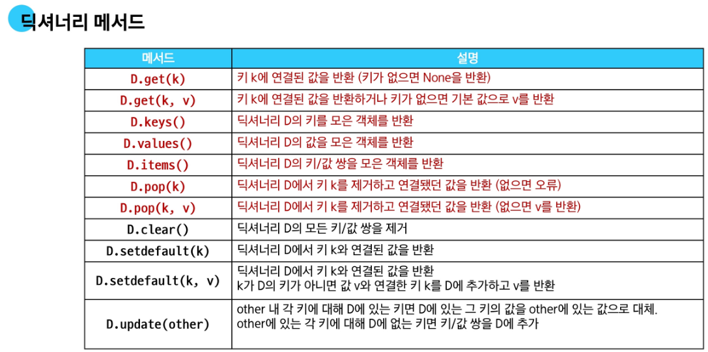
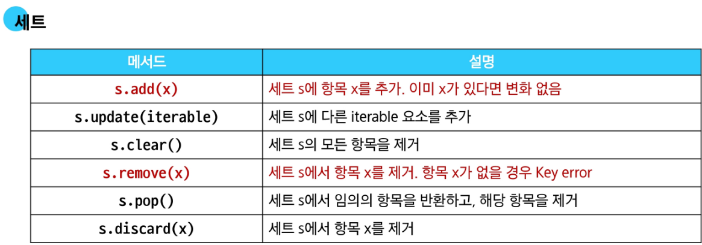

# Python Data structure-2

### 비시퀀스 데이터 구조

### 1. 딕셔너리

Key와 Value을 짝지어 저장하는 자료구조

### 2. 세트

고유한 항목들의 정렬되지 않은 컬렉션

### 3. 해시 테이블 hash table

해시 테이블은 ‘Key’ 와 ‘Value’을 짝지어 저장하는 자료구조

**해시 테이블의 원리**

1. 키를 해시 함수를 통해 해시 값으로 변환
2. 변환된 해시 값을 인덱스로 삼아 데이터를 저장하거나 찾음
3. 이로 인해 검색, 삽입, 삭제를 매우 빠르게 수