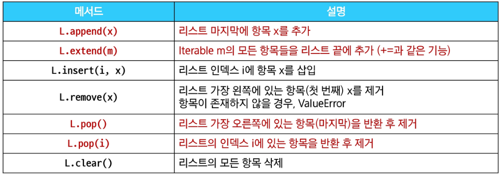

# Python Data structure

### 메서드 method

문자열, 리스트, 딕셔너리 등 각 데이터 구조의 메서드를 호출하여 다양한 기능을 활용하기

> 메서드는 어딘가(클래스)에 속해있는 함수이며, 각 데이터 타입별로 다양한 기능을 가진 메서드가 존재

### 시퀀스 데이터 구조

1. **문자열**

- .find(x) : x의 첫 번째 위치를 반환. 없으면, -1을 반환
- .index(x) : x의 첫 번째 위치를 반환. 없으면, 오류 발생
- .isupper(x), .islower(x) : 문자열이 모두 대문자/소문자로 이루어져 있는지 확인
- .isalpha(x) : 문자열이 알파벳으로만 이루어져 있는지 확인

**문자열 조작 메서드**

- .replace(old, new[,count]) : 바꿀 대상 글자를 새로운 글자로 바꿔서 반환
- .strip([chars]) : 문자열의 시작과끝에 있는 공백 혹은 지정한 문제를 제거
- .split(sep=None, maxsplit=-1) : sep를 구분자 문자열로 사용하여 문자열에 있는 단어들의 리스트를 반환
- .separator, .join(iterable) : iterable의 문자열을 연결한 문자열을 반환

**리스트**

**리스트 탐색 및 정렬 메서드**

### 가변/불변 객체의 개념

- 객체 복사의 핵심을 파악하려면, 파이썬 자료구조의 가변과 불변 두 가지 종류를 살펴봐야 한다.

**Mutable(가변) 객체**

- 생성 후 내용을 변경할 수 있는 객체
- ex) 리스트, 딕셔너리, set

**Immutable(불변) 객체**

- 생성 후 내용을 변경할 수 없는 객체
- ex) int, float, str, tuple

### 얕은 복사 Shallow Copy

객체의 최상위 요소만 새로운 메모리에 복사하는 방법, 내부에 중첩된 객체가있다면 그 객체의 참조만 복사됨.

**얕은 복사 구현 방법**

1. 리스트 슬라이싱
2. copy() 메서드
3. list() 함수

### 깊은 복사 Deep Copy

객체의 모든 수준의 요소를 새로운 메모리에 복사하는 방법, 중첩된 객체까지 모두 새로운 객체로 생성됨.