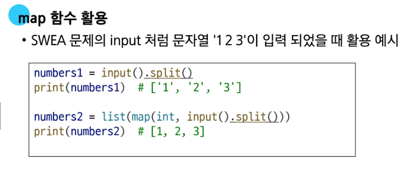
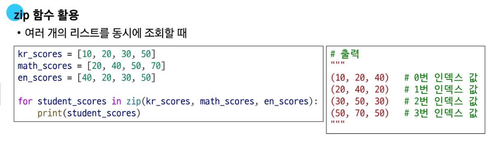

# Python Module & Control of Flow

### 1. 모듈 Module

한파일로 묶인 변수와 함수의 모음, 특정한 기능을 하는 코드가 작성된 파이썬 파일(.py)

**모듈 예시**

- math 내장 모듈 - 파이썬이 미리 작성해 둔 수학 관련 변수와 함수가 작성된 모듈

### 2. 패키지 Package

연관된 모듈들을 하나의 디렉토리에 모아 놓은 것

- PSL (Python Standard Library) 내부 패키지
- 파이썬 외부 패치지

**패키지 사용 목적**

- 모듈들의 이름공간을 구분하여 충돌을 방지
- 모듈들을 효율적으로 관리하고 할 수 있도록 돕는 역할

### 3. 제어문

코드의 실행 흐름을 제어하는 데 사용되는 구문, 조건에 따라 코드 블록을 실행하거나 반복적으로 코드를 실행

### 4. 조건문

주어진 조건식을 평가하여 해당 조건이 참(True)인 경우에만 코드 블록을 실행하거나 건너뜀

- if / elif / else

**복수 조건문**

- 조건식을 동시에 검사하는 것이 아니라 “순차적”으로 비교
- 조건식의 순서에 따라 원하는 결과가 나오지 않을 수 있음을 주의

**중첩 조건문**

- 조건문 (if) 내부에 또 다른 조건문 (if) 작성 가능

### 5. 반복분

주어진 코드 블록을 여러 번 반복해서 실행하는 구문

**for문**

- 반복 가능한 객체의 요소들을 반복하는데 주로 사용
- 주로 반복 가능한 객체 요소의 개수만큼 반복
- 특징 : 반복 횟수가 정해져 있음

**while문**

- while 조건이 참(True)인 동안 반복
- 반복 횟수가 정해지지 않은 경우 주로 사용

### 6. 유용한 내장 함수 map & zip

**map(function, iterable)**

반복 가능한 데이터구조(iterable)의 모든 요소에 function을 적용하고, 그 결과 값들을 map object로 묶어서 반환

**zip(iterables)**

zip 함수는 여러 개의 반복 가능한 데이터 구조를 묶어서, 같은 위치에 있는 값들을 하나의 tuple로 만든 뒤 그것들을 모아 zip object로 반환하는 함수