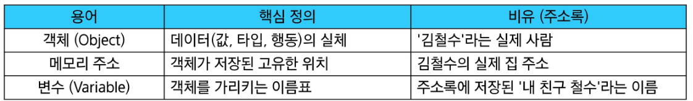
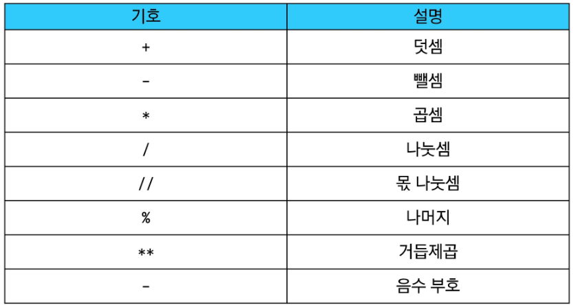
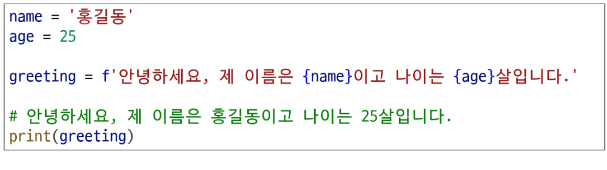
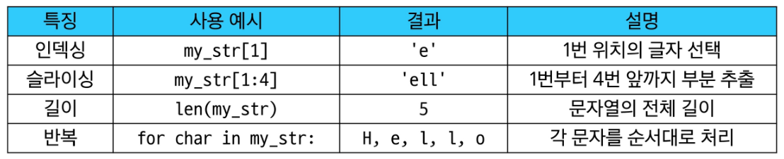

# Python Basic Syntax 1

## 변수 Variable

값을 나중에 다시 사용하기 위해, 그 값에 붙여주는 고유한 이름, “객체를 가리키는 이름”

**변수와 메모리**

## 타입 Type

변수나 값이 가질 수 있는 데이터의 종류를 의미 / 어떤 종류의 데이터인지, 어떻게 해석되고 처리되어야 하는지를 정의

### 데이터 타입 분류 5가지

- **Numeric Types** : int (정수), float (실수), complex (복소수)
- **Text Sequence Type** : str (문자열)
- **Sequence Types** : list, tuple, range
- **Non-sequence Types** : set, dict
- **기타** : Boolean, None, Functions

## 숫자형 데이터 Numeric Types

1. 정수형(int) : 소수점이 없는 숫자
2. 실수형(float) : 소수점이 있는 숫자

### 산술 연산자

### 시퀀스 타입의 5가지 공통 특징

1. **순서(Order)**
- 값들이 순서대로 저장 (정렬 X)
1. **인덱싱(Indexing)**
- 각 값에 고유 번호(인덱스)를 가지고 있으며, 인덱스를 사용하여 특정 위치의 값을 선택하거나 수정할 수 있음
1. **슬라이싱(Slicing)**
- 인덱스 범위를 조절해 전체 데이터 중 원하는 부분만 값을 잘라내서 사용할 수 있음
1. **길이(Length)**
- len() 함수를 사용하여 저장된 값의 개수(길이)를 구할 수 있음
1. **반복(iteration)**
- 반복문을 사용하여 각 값을 하나씩 순서대로 꺼내 사용할 수 있음

### f-string

문자열 내에 변수나 표현식의 결과를 손쉽게 삽입하는 강력한 방법

### 시퀀스로서의 문자열 활용

