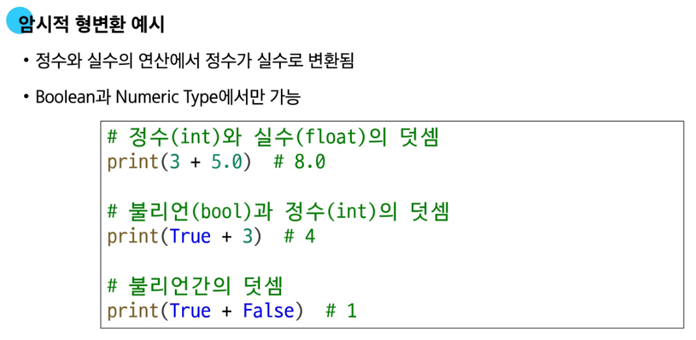

# Python Basic Syntax 2

### 1. 리스트 list (가변성 : 생성된 후에도 그 내용(값)을 변경할 수 있는 성질)

여러 개의 값을 순서대로 저장하는, 변경 가능한(mutable) 시퀀스 자료

### 2. 중첩 리스트 Nested List

다른 리스트를 값으로 가진 리스트

### 3. 튜플 tuple (수정불가능)

여러 개의 값을 순서대로 저장하는 변경 불가능한 시퀀스 자료형

- 소괄호 () 안에 값들을 쉼표(,)로 구분하여 만듬
- 모든 종류의 데이터를 담을 수 있음
- 리스트와 거의 모든 면에서 비슷하지만, 한번 만들어지면 절대 수정할 수 없다는 결정적인 차이가 있음.

## 4. range

연속된 정수 시퀀스를 생성하는 변경 불가능한 자료형

- 주로 반복문과 함께 사용되어 특정 횟수만큼 코드를 반복 실행할 때 유용
- 실제로 모든 숫자를 메모리에 저장하는 대신, 시작 값, 끝 값, 간격이라는 ‘규칙’만 기억하여 메모리를 효율적으로 사용.

### 5. 딕셔너리 dict

key - value 쌍으로 이루어진 순서와 중복이 없는 변경 가능한 자료

**표현**

- 중괄호 {} 안에 값들이 쉼표(,)로 구분되어 있음
- 값 1개는 키와 값이 쌍으로 이루어져 있음
- Key(키) : 값을 식별하기 위한 고유한 ‘이름표’ - Key는 중복될 수 없음
- Value(값) : 키에 해당하는 실제 데이터 - 어떤 자료형이든 자유롭게 사용할 수 있음
- 각 값에는 순서가 없음

### 5. Set

순서와 중복이 없는 변경 가능한 자료

**표현**

- 중괄호 {} 안에 값들을 쉼표(,)로 구분하여 만듦
- 수학에서의 집합과 동일한 연산 처리 가능

**특징**

- 중복을 허용하지 않음 > 똑같은 값은 단 하나만 존재할 수 있음
- 순서가 없음 > 인덱싱(set[0])이나 슬라이싱(set[0:2])을 사용할 수 없음

### 6. Other Types

**None** : 파이썬에서 ‘값이 없음’을 표현하는 특별한 데이터 타입

**Boolean** : ‘참(True)’과 ‘거짓(False)’ 단 두 가지 값만 가지는 데이터 타입

**Collection** : 여러 개의 값을 하나로 묶어 관리하는 자료형들을 통칭하는 말

### 형변환 Type Conversion

한 데이터 타입을 다른 데이터 타입으로 변환하는 과정

- 예를 들어, 문자열 “100”을 숫자 100으로 바꾸거나, 숫자 3.14를 정수3으로 바꾸는 등 데이터의 ‘형태’를 필요에 따라 바꾸는 것.
- **암시적 형변환** : 파이썬이 자동으로 처리

- **명시적 형변환** : 개발자가 직접 지시

### 산술 연산자

