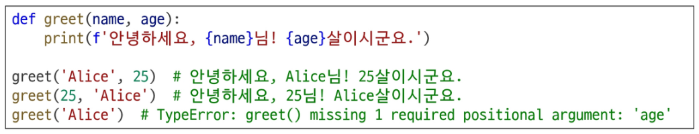

# Python 함수

### 함수(Function)

특정 작업을 수행하기 위한 재사용 가능한 코드 묶음

**사용이유**

- 두 수의 합을 구하는 함수를 정의하고 사용함으로써 코드의 중복을 방지
- 재사용성이 높아지고, 코드의 가독성과 유지보수성 향상

### 다양한 인자 종류

1. **위치 인자**
- 함수 호출 시 인자의 위치에 다라 전달되는 인자
- 위치 인자는 함수 호출 시 반드시 값을 전달해야 함

1. **기본 인자 값**
- 함수 정의에서 매개변수에 기본 값을 할당하는 것
- 함수 호출 시 인자를 전달하지 않으면, 기본값이 매개변수에 할당됨

.png)

1. **키워드 인자**
- 함수 호출 시 인자의 이름과 함께 값을 전달하는 인자
- 매개변수와 인자를 일치시키지 않고, 특정 매개변수에 값을 할당할 수 있음
- 인자의 순서는 중요하지 않으며, 인자의 이름을 명시하여 전달
- 단, 호출 시 키워드 인자는 위치 인자 뒤에 위치해야 함

.png)

1. **임의의 인자 목록**
- 정해지지 않은 개수의 인자를 처리하는 인자
- 함수 정의 시 매개변수 앞에 ‘*’를 붙여 사용
- 여러 개의 인자를 tuple로 처리

.png)

1. **임의의 키워드 인자 목록**
- 정해지지 않은 개수의 키워드 인자를 처리하는 인자
- 함수 정의 시 매개변수 앞에 ‘**’를 붙여 사용
- 여러 개의 인자를 dictionary로 묶어 처리

.png)

### 재귀 함수

함수 내부에서 자기 자신을 호출하는 함수

ex) factorial function

**특징**

- 특정 알고리즘 식을 표현할 때 변수의 사용이 줄어들며, 코드의 가독성이 높아짐
- 1개 이상의 base case(종료되는 상황)가 존재하고, 수렴하도록 작성

**재귀 함수 사용 이유**

- 문제의 자연스로운 표현
- 코드 간결성
- 수학적 문제 해결

### 내장 함수

파이썬이 기본적으로 제공하는 함수

### 함수와 Scope

함수는 코드 내부에 local scope를 생성하며, 그 외의 공간인 global scope로 구분

**범위와 변수 관게**

**scope**

- global scope : 코드 어디에서든 참조할 수 있는 공간
- local scope : 함수가 만든 scope (함수 내부에서만 참조 가능)

**variable**

- global variable : global scope에 정의된 변수
- local variable : local scope에 정의된 변

.png)

.png)

### 패킹 Packing

여러 개의 데이터를 하나의 컬렉션으로 모아 담는 과정

- 여러 개의 값을 하나의 튜플로 묶는 파이썬의 기본 동작
- 한 변수에 콤마(,)로 구분된 값을 넣으면 자동으로 튜플로 처리

### 언패킹 Unpacking

컬렉션에 담겨있는 데이터들을 개별 요소로 펼쳐 놓는 과정

- 튜플이나 리스트 등의 객체의 요소들을 개별 변수에 할당
- ‘시퀀스 언패킹’ 또는 ‘다중 할당’ 이라고 부름

.png)

.png)
